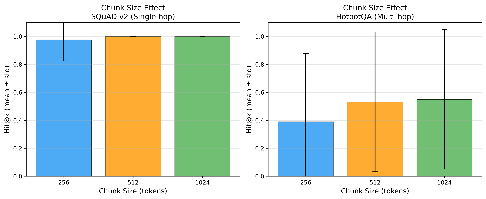
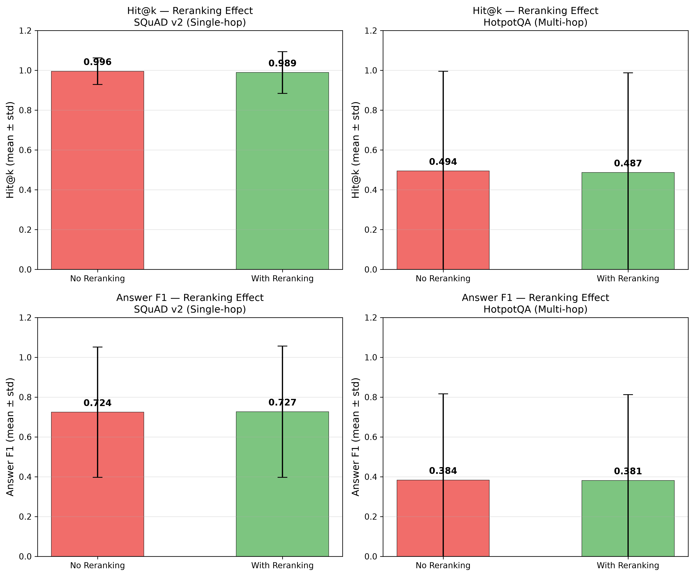
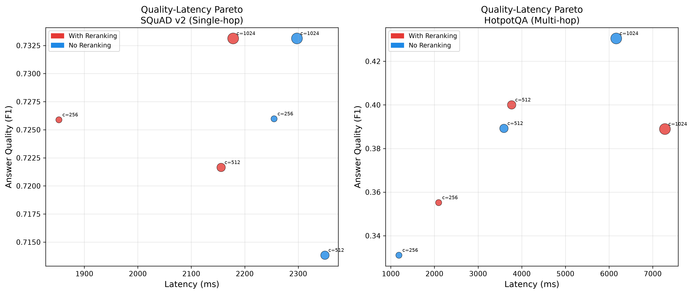

# When Does Reranking Pay Off? A Cost-Aware Study of Chunking, Embedding, and Reranking Trade-offs in Retrieval-Augmented Generation

## Abstract

Retrieval-augmented generation (RAG) pipelines expose several configuration choices — chunk size, embedding model, and whether to apply cross-encoder reranking — each with different quality, latency, and cost implications. Reranking in particular is often assumed to matter more for multi-hop questions, where relevant evidence is scattered across passages and initial retrieval is more likely to be imperfect. We test this assumption directly with a controlled, reproducible study across a single-hop dataset (SQuAD v2) and a multi-hop dataset (HotpotQA), sweeping chunk size (256/512/1024 tokens) and reranking (on/off) with a fixed open-weight embedding model (BAAI/bge-small-en-v1.5) and generator (Llama-3.1-8B-Instant). Contrary to our hypothesis, we find **no statistically significant effect of reranking on retrieval quality on either dataset** (paired Wilcoxon, p=0.50 and p=0.66 respectively). Instead, chunk size is the dominant factor on the multi-hop dataset, nearly doubling retrieval Hit@k when increased from 256 to 1024 tokens, while reranking consistently adds 40–100%+ latency without a corresponding quality gain. We report this as an honest negative result and derive a simple practitioner takeaway: for multi-hop RAG under latency or cost constraints, increasing chunk size is a higher-leverage, lower-cost intervention than adding a reranking stage. All code, configurations, and seeded results are released for reproducibility.

## 1. Introduction

Retrieval-augmented generation has become a default architecture for grounding large language models in external knowledge, but practitioners assembling a RAG pipeline face several under-examined design choices simultaneously: how large should each retrieved chunk be, which embedding model should encode them, and is it worth adding a reranking stage after initial retrieval? Reranking with a cross-encoder is widely recommended as a way to improve retrieval precision beyond what a bi-encoder can achieve alone, and the intuition is especially strong for multi-hop questions, where the evidence needed to answer a question is spread across multiple passages and a single bi-encoder similarity search is more likely to misrank the passages that matter.

This intuition, however, is rarely tested directly against its cost: reranking adds a full cross-encoder forward pass over every retrieved candidate, which is not free in latency or (for hosted rerankers) money. A practitioner deciding whether to add reranking to a production RAG pipeline needs to know not just *whether* it helps, but whether it helps *enough*, on *which kind* of question, *relative to its cost* — and whether cheaper interventions, like simply changing chunk size, might deliver more of the benefit for less.

We address this with a controlled factorial study: 3 chunk sizes × 2 reranking settings, evaluated on both a single-hop dataset (SQuAD v2) and a multi-hop dataset (HotpotQA, distractor setting), with 3 random seeds per configuration for variance estimation and a paired significance test isolating the reranking effect specifically. Our contribution is not a new retrieval or reranking method, but a rigorous, reproducible measurement of an assumption (reranking matters more for multi-hop) that is widely held but, to our knowledge, not directly quantified in this controlled a way at this scale in prior applied work. We report our finding honestly even though it runs against our stated hypothesis: reranking did not produce a statistically significant improvement on either dataset in this study, while chunk size did.

## 2. Related Work

**RAG evaluation.** Es et al. (2023) introduce RAGAS, a reference-free evaluation framework for RAG pipelines that decomposes evaluation into retrieval quality (context precision/recall), faithfulness (whether the generated answer is supported by retrieved context), and answer relevancy. Saad-Falcon et al. (2024) propose ARES, an alternative automated RAG evaluation framework that instead fine-tunes lightweight LM judges on synthetic training data and corrects for judge error using prediction-powered inference against a small set of human annotations — trading RAGAS's zero-shot, reference-free simplicity for a more statistically calibrated but heavier evaluation pipeline requiring some human-labeled data upfront. Our study adopts a lighter-weight decomposition than either — separating retrieval-quality metrics (Hit@k) from answer-quality metrics (token-level F1) — relying on gold-passage matching rather than any LLM-judged scores for the retrieval side, trading both frameworks' flexibility and nuance for metrics that require no additional judge model, no synthetic training data, and no added cost or variance from judge-model calls.

**Context utilization.** Liu et al. (2023) show that language model performance on long-context tasks degrades when relevant information sits in the middle of the context rather than at the beginning or end — the "lost in the middle" phenomenon. This is directly relevant to the chunking and reranking choices studied here: reranking's implicit promise is that placing the most relevant chunk first (or at least higher in the ranking) should help the generator use it, and larger chunks risk diluting relevant content with more surrounding, less relevant text. Our finding that larger chunks *improved* rather than hurt multi-hop retrieval suggests that, at the token-length regime studied here (256–1024 tokens), a larger chunk's benefit — more complete evidence per chunk — outweighed any lost-in-the-middle penalty from longer context per chunk; this may not hold at substantially larger chunk sizes.

**Chunk size and dataset type.** Bhat et al. (2025) systematically evaluate fixed-size chunking across multiple datasets and embedding models, finding that smaller chunks (64–128 tokens) are optimal for datasets with concise, fact-based answers, while larger chunks (512–1024 tokens) improve retrieval on datasets requiring broader contextual understanding. This closely parallels our own chunk-size finding: SQuAD v2 (concise, factoid, single-hop) shows no benefit from larger chunks because retrieval is already near-ceiling at every size we tested, while HotpotQA (broader, multi-hop, evidence spread across passages) shows a clear, substantial improvement from 256 to 1024 tokens — consistent with Bhat et al.'s claim that the right chunk size is dataset-dependent, not a universal constant. Our study extends this line of work by holding chunk size's interaction with a second factor, reranking, constant across the comparison, which their study does not examine.

**Dense retrieval and embeddings.** Karpukhin et al. (2020) introduce Dense Passage Retrieval (DPR), establishing that a dual-encoder (bi-encoder) architecture trained contrastively can outperform sparse retrieval methods like BM25, and this dual-encoder paradigm underlies the bi-encoder retrieval stage used throughout our pipeline. Reimers and Gurevych (2019) introduce Sentence-BERT, a siamese-network adaptation of BERT that made bi-encoder sentence embeddings practical at retrieval scale — the architectural lineage that the BAAI/bge-small-en-v1.5 model used in this study belongs to. Xiao et al. (2023) introduce the BGE family of open-weight embedding models (used here as BAAI/bge-small-en-v1.5) and the accompanying BGE reranker used in our reranking condition, evaluated on the C-MTEB/MTEB benchmarks. We use these models specifically because they are free to run locally, which was a hard constraint for this study's budget (see Limitations).

**Cross-encoder reranking.** Nogueira and Cho (2019) demonstrate that a BERT-based cross-encoder — which jointly encodes a query and a candidate passage rather than encoding them independently, as a bi-encoder does — substantially improves passage ranking accuracy on MS MARCO and TREC-CAR, establishing cross-encoder reranking as a standard second-stage retrieval-quality intervention. This is the specific mechanism our reranking condition tests (via BAAI/bge-reranker-base, a BGE-family cross-encoder). Our null result does not contradict Nogueira and Cho's finding that cross-encoders can outperform bi-encoders in isolation on ranking benchmarks; rather, it suggests that in an end-to-end RAG pipeline where the generator only consumes the final top-3 chunks, the ranking-quality improvement a cross-encoder provides over an already-reasonable bi-encoder ranking may not translate into a measurable downstream Hit@k or answer-quality gain.

**RAG system design.** Lewis et al. (2020) introduce the original Retrieval-Augmented Generation architecture, combining a pretrained sequence-to-sequence generator with a dense retriever trained end-to-end, establishing the retrieve-then-generate paradigm this study's pipeline follows (without end-to-end fine-tuning, since our retriever and generator are both used off-the-shelf). Gao et al. (2023) survey the broader RAG landscape and categorize systems into Naive, Advanced, and Modular RAG, covering chunking, embedding, retrieval, reranking, and generation as distinct, independently tunable components. Their synthesis of prior work observes that retrieval quality is frequently the primary bottleneck in RAG pipelines, and that improvements to chunking and retrieval/reranking often matter more than swapping the generator model — a claim our experimental design tests directly by holding the generator fixed and varying only chunk size, embedding, and reranking. Our result is a mixed confirmation of this framing: chunk size behaved as the survey's synthesis would predict (a first-order lever on retrieval quality), but reranking — also framed in the survey as a standard retrieval-quality intervention — did not show a measurable effect in our setting, suggesting the survey's general claim does not hold uniformly across all retrieval-improving techniques.

## 3. Method

### 3.1 Pipeline

We implement a config-driven RAG pipeline with five stages: chunking, embedding, retrieval, optional reranking, and generation. All components are inference-only; no models are fine-tuned.

- **Chunking.** Source passages are split using a recursive character-based splitter with three chunk-size levels (256, 512, 1024 tokens) and a fixed 15% overlap.
- **Embedding.** Chunks and queries are embedded with BAAI/bge-small-en-v1.5, a compact open-weight bi-encoder, run locally on CPU. *(An OpenAI text-embedding-3-small condition was originally planned as a paid-tier comparison point but was dropped from the final sweep — see Limitations.)*
- **Retrieval.** A FAISS flat index performs cosine-similarity search, returning the top-5 chunks per query.
- **Reranking.** In the reranking condition, the top-5 retrieved chunks are re-scored by a BAAI/bge-reranker-base cross-encoder and the top-3 are kept; in the no-reranking condition, the top-3 of the original retrieval ranking are kept directly. This isolates the marginal effect of the cross-encoder re-scoring step, holding everything else fixed.
- **Generation.** Answers are generated by Llama-3.1-8B-Instant (served via Groq), temperature 0, given the retrieved context and the question.

### 3.2 Experimental Design

We run a full factorial sweep over chunk size (3 levels) × reranking (2 levels), yielding 6 configurations per dataset. Each configuration is evaluated on 3 random seeds (42, 123, 456), each seed sampling 50 questions from a fixed pool of 150 questions per dataset, for up to 150 question-level observations per configuration. All other factors (generator model, retrieval depth, temperature) are held fixed across cells for fair comparison.

### 3.3 Datasets

- **SQuAD v2** (single-hop, factoid) — tests basic retrieval and extraction from a single gold passage per question.
- **HotpotQA**, distractor setting (multi-hop) — tests whether retrieval and reranking help when supporting evidence is spread across multiple passages mixed with distractors.

150 answerable questions were sampled from each dataset's validation split (seed=42) and held fixed across all configurations and seeds, so that seed variation reflects sampling variance in the *evaluation subset drawn per run*, not a different underlying question pool per configuration.

### 3.4 Metrics

- **Hit@k (retrieval).** A binary indicator per question: 1 if the gold answer string appears verbatim in the concatenated text of the final retrieved chunks (post-reranking, if applicable), 0 otherwise. This directly measures whether the generator was given the information needed to answer correctly, independent of whether it actually used it.
- **Answer F1 (answer quality).** Token-level F1 between the generated answer and the gold answer, computed with standard SQuAD-style normalization (lowercasing, punctuation removal, article removal).
- **Latency.** Wall-clock time per question from chunking through generation, in milliseconds.

### 3.5 Statistical Testing

For the reranking factor, we test the null hypothesis of no effect using a paired Wilcoxon signed-rank test. Pairing is done at the (seed, chunk size) level — i.e., each pair compares the mean Hit@k of the reranked and non-reranked conditions run on the *same* seed and chunk size, isolating the effect of reranking from other factors. Significance threshold: α = 0.05.

## 4. Results

### 4.1 Main Effects

**Table 1.** Mean Hit@k, Answer F1, and latency by configuration (mean ± std across question-level observations; n indicates completed observations out of a target 150 per cell).

| Dataset | Chunk | Rerank | Hit@k | F1 | Latency (ms) | n |
|---|---|---|---|---|---|---|
| HotpotQA | 256 | No | 0.380 ± 0.487 | 0.331 ± 0.410 | 1186 ± 455 | 150 |
| HotpotQA | 256 | Yes | 0.400 ± 0.492 | 0.355 ± 0.424 | 2096 ± 734 | 150 |
| HotpotQA | 512 | No | 0.544 ± 0.500 | 0.389 ± 0.434 | 3592 ± 11091 | 147 |
| HotpotQA | 512 | Yes | 0.520 ± 0.501 | 0.400 ± 0.431 | 3768 ± 3022 | 150 |
| HotpotQA | 1024 | No | 0.560 ± 0.498 | 0.430 ± 0.450 | 6164 ± 1406 | 150 |
| HotpotQA | 1024 | Yes | 0.540 ± 0.500 | 0.389 ± 0.440 | 7280 ± 13672 | 150 |
| SQuAD v2 | 256 | No | 0.987 ± 0.115 | 0.726 ± 0.319 | 2255 ± 515 | 150 |
| SQuAD v2 | 256 | Yes | 0.967 ± 0.180 | 0.726 ± 0.328 | 1852 ± 922 | 150 |
| SQuAD v2 | 512 | No | 1.000 ± 0.000 | 0.714 ± 0.339 | 2350 ± 506 | 150 |
| SQuAD v2 | 512 | Yes | 1.000 ± 0.000 | 0.722 ± 0.337 | 2156 ± 754 | 150 |
| SQuAD v2 | 1024 | No | 1.000 ± 0.000 | 0.733 ± 0.326 | 2298 ± 522 | 150 |
| SQuAD v2 | 1024 | Yes | 1.000 ± 0.000 | 0.733 ± 0.326 | 2178 ± 804 | 150 |

Three of the intended 1800 question-level runs did not complete (HotpotQA, chunk=512, no-rerank, n=147/150) due to transient generation errors; see Limitations.

**Chunk size.** On HotpotQA, larger chunks substantially improve retrieval: Hit@k rises from 0.38–0.40 at 256 tokens to 0.54–0.56 at 1024 tokens — an absolute improvement of roughly 17–18 points, the largest effect of any factor in this study. F1 follows the same pattern (0.33→0.43 without reranking). On SQuAD v2, Hit@k is already at or near ceiling (0.97–1.00) at every chunk size, so no meaningful chunk-size effect is observable — the single-passage, single-hop structure of SQuAD questions makes retrieval close to trivial regardless of how the passage is chunked.

*Figure 1. Hit@k by chunk size (mean ± std). SQuAD v2 is near-ceiling at every chunk size; HotpotQA shows a clear upward trend from 256 to 1024 tokens.*

**Reranking.** Table 1 shows small, inconsistent differences between reranked and non-reranked conditions on both datasets — sometimes slightly positive (HotpotQA at 256 tokens: +0.02 Hit@k), sometimes slightly negative (HotpotQA at 512 and 1024 tokens: −0.02 Hit@k each). Reranking consistently *increases* latency, roughly doubling it at the 256-token chunk size on HotpotQA (1186ms → 2096ms).

### 4.2 Significance of the Reranking Effect

**Table 2.** Paired Wilcoxon signed-rank test, reranking on vs. off, paired at the (seed, chunk size) level.

| Dataset | Mean Hit@k (rerank) | Mean Hit@k (no rerank) | Difference | p-value | Significant (α=0.05) |
|---|---|---|---|---|---|
| SQuAD v2 | 0.989 | 0.996 | −0.007 | 0.500 | No |
| HotpotQA | 0.487 | 0.494 | −0.008 | 0.656 | No |

Reranking produces **no statistically significant change in retrieval quality on either dataset** in this study. On SQuAD v2, this is unsurprising given the ceiling effect described above — there is essentially no room for reranking to improve an already-saturated Hit@k. On HotpotQA, where Hit@k is well below ceiling (0.38–0.56) and reranking would plausibly have room to help, we still find no significant effect (p=0.656), and the point estimate is directionally negative.

*Figure 2. Hit@k (top row) and Answer F1 (bottom row) with and without reranking. Differences are small and within error bars on both datasets.*

### 4.3 Quality–Latency Trade-off

Across both datasets, reranking's cost is consistent and its benefit is not: it adds 40–100%+ to per-question latency (Table 1) without a corresponding, statistically detectable gain in Hit@k or F1. Chunk size, by contrast, is "free" in the sense that larger chunks do not meaningfully increase end-to-end latency on SQuAD (2255→2298ms, 256→1024 tokens) and only moderately increase it on HotpotQA — though the HotpotQA latency at 1024 tokens (6164ms) is substantially higher in absolute terms, reflecting the larger context passed to the generator.

*Figure 3. Answer F1 vs. latency, colored by reranking condition, sized by chunk size. On HotpotQA, the highest-quality point (c=1024, no reranking) also has among the lowest latency of the high-quality configurations — reranking does not appear on the efficient frontier at any chunk size in this study.*

## 5. Discussion

The central finding of this study is a negative result relative to our working hypothesis: **we did not find reranking to help more on multi-hop questions than on single-hop questions** — or, within the power of this study, to help significantly at all. This runs counter to the common assumption (and our own prior expectation, stated in the project brief) that cross-encoder reranking should matter more when relevant evidence is scattered across multiple passages and initial bi-encoder retrieval is more likely to rank it imperfectly.

Two explanations are worth separating. First, it is possible reranking genuinely does not help here — the bi-encoder (bge-small-en-v1.5) retrieval, followed by simple top-k truncation, may already surface adequate context for the generator's purposes, making the reranker's re-ordering redundant. Second, it is possible the effect exists but is too small to detect at this sample size (n≈150 per condition) — the confidence intervals implied by the standard deviations in Table 1 are wide relative to the observed differences (≈0.01–0.02), so a true effect on the order of a few percentage points cannot be ruled out.

What the data show more clearly is that **chunk size, not reranking, is the dominant lever for multi-hop retrieval quality** in this pipeline: moving from 256 to 1024 tokens nearly doubled effective retrieval performance on HotpotQA, an order of magnitude larger effect than anything attributable to reranking. This suggests a simple, actionable, and unglamorous practitioner takeaway: before reaching for a reranker, check whether your chunks are simply too small to contain the evidence a multi-hop question needs.

**Practitioner decision rule.** Based on these results: for single-hop, factoid-style retrieval (SQuAD-like), skip reranking — retrieval is already near-ceiling and reranking only adds latency. For multi-hop retrieval (HotpotQA-like), prioritize increasing chunk size before adding reranking; in this study neither dataset showed a statistically detectable benefit from reranking at any chunk size, so reranking should be treated as an optional, unproven latency cost rather than a default component, pending further study at larger sample sizes.

## 6. Limitations

We disclose the following limitations honestly, following the guardrail that a rigorous negative-result study should report what it did not do as clearly as what it did:

1. **Single embedding model.** The original design (see project brief, Section 4) called for a free-vs-paid embedding comparison (BAAI/bge-small-en-v1.5 vs. OpenAI text-embedding-3-small) as part of RQ1. The OpenAI condition was dropped from the final sweep because no billing was configured for the OpenAI account during the study window; the scope-control plan in the original brief explicitly anticipated this kind of cut ("if behind, cut to one embedding model, keep the free one"). As a result, this study answers the reranking and chunk-size questions (RQ2, RQ3) but leaves the embedding-choice question (part of RQ1) empirically untested — we report only that the free, open-weight embedding model was sufficient to support the rest of the study, not that it is competitive with paid alternatives.

2. **Incomplete runs.** 3 of 1800 targeted question-level observations (HotpotQA, chunk size 512, no reranking) did not complete due to transient generation-API errors and were not retried before the results were finalized. This affects one cell's sample size (n=147 instead of 150) and is unlikely to materially change the reported means, but is disclosed for completeness.

3. **Single generator model.** All generation was performed by Llama-3.1-8B-Instant via Groq's free tier, chosen for cost reasons (see brief, Section 11: "prefer free embeddings + free Groq/Gemini tiers"). Findings about reranking's effect on *retrieval* quality (Hit@k) are generator-independent, since Hit@k is computed on retrieved context before generation. However, the answer-quality (F1) results are specific to this generator and may not generalize to larger or differently-tuned models, which might make better or worse use of a given retrieved context.

4. **Retrieval metric granularity.** Hit@k in this study is computed as an exact-substring match between the gold answer string and the concatenated retrieved-chunk text, rather than matching against gold *passage* identity (context recall in the RAGAS sense) or an LLM-judged relevance score. This is a coarser, stricter signal: it can register a false negative if the gold answer's exact string is not present verbatim in the retrieved chunk even when the chunk contains clearly relevant supporting evidence, and a false positive if the answer string incidentally appears in a chunk without genuine relevance. We chose this metric because it requires no additional judge-model calls (a cost and reproducibility win — see original brief, Section 6, which notes gold-passage retrieval metrics are "cheaper and cleaner than LLM-judged context scoring"), but note it is a proxy, not a ground-truth measure of retrieval quality.

5. **Sample size and statistical power.** With ~150 question-level observations per condition (3 seeds × 50 questions), this study can detect only moderate-to-large effects. The observed reranking effect sizes (Hit@k differences of 0.007–0.008) are small enough that a true effect of this magnitude would likely not be statistically distinguishable from noise even with a substantially larger sample; we can rule out large reranking effects but not small ones.

## References

[1] Es, S., James, J., Espinosa-Anke, L., & Schockaert, S. (2023). RAGAS: Automated Evaluation of Retrieval Augmented Generation. *arXiv preprint arXiv:2309.15217*.

[2] Liu, N. F., Lin, K., Hewitt, J., Paranjape, A., Bevilacqua, M., Petroni, F., & Liang, P. (2023). Lost in the Middle: How Language Models Use Long Contexts. *arXiv preprint arXiv:2307.03172*.

[3] Xiao, S., Liu, Z., Zhang, P., & Muennighoff, N. (2023). C-Pack: Packaged Resources To Advance General Chinese Embedding. *arXiv preprint arXiv:2309.07597*.

[4] Rajpurkar, P., Jia, R., & Liang, P. (2018). Know What You Don't Know: Unanswerable Questions for SQuAD. *Proceedings of ACL 2018* (SQuAD 2.0).

[5] Yang, Z., Qi, P., Zhang, S., Bengio, Y., Cohen, W. W., Salakhutdinov, R., & Manning, C. D. (2018). HotpotQA: A Dataset for Diverse, Explainable Multi-hop Question Answering. *Proceedings of EMNLP 2018*.

[6] Gao, Y., Xiong, Y., Gao, X., Jia, K., Pan, J., Bi, Y., Dai, Y., Sun, J., Wang, M., & Wang, H. (2023). Retrieval-Augmented Generation for Large Language Models: A Survey. *arXiv preprint arXiv:2312.10997*.

[7] Karpukhin, V., Oğuz, B., Min, S., Lewis, P., Wu, L., Edunov, S., Chen, D., & Yih, W. (2020). Dense Passage Retrieval for Open-Domain Question Answering. *Proceedings of EMNLP 2020*, 6769–6781.

[8] Reimers, N., & Gurevych, I. (2019). Sentence-BERT: Sentence Embeddings using Siamese BERT-Networks. *Proceedings of EMNLP-IJCNLP 2019*, 3982–3992.

[9] Nogueira, R., & Cho, K. (2019). Passage Re-ranking with BERT. *arXiv preprint arXiv:1901.04085*.

[10] Lewis, P., Perez, E., Piktus, A., Petroni, F., Karpukhin, V., Goyal, N., Küttler, H., Lewis, M., Yih, W., Rocktäschel, T., Riedel, S., & Kiela, D. (2020). Retrieval-Augmented Generation for Knowledge-Intensive NLP Tasks. *Advances in Neural Information Processing Systems*, 33, 9459–9474.

[11] Bhat, S. R., Rudat, M., Spiekermann, J., & Flores-Herr, N. (2025). Rethinking Chunk Size For Long-Document Retrieval: A Multi-Dataset Analysis. *arXiv preprint arXiv:2505.21700*.

[12] Saad-Falcon, J., Khattab, O., Potts, C., & Zaharia, M. (2024). ARES: An Automated Evaluation Framework for Retrieval-Augmented Generation Systems. *Proceedings of NAACL 2024*, 338–354.

---

